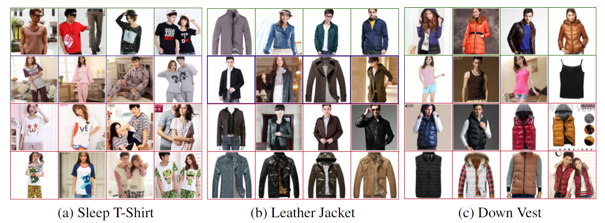

<div align="center">

# Subclass-Dominant Label Noise: A Counterexample for the Success of Early Stopping

</div>

Official implementation of Subclass-Dominant Label Noise: A Counterexample for the Success of Early Stopping (NeurIPS 2023).

In this paper, we empirically investigate a previously overlooked and widespread type of label noise, subclass-dominant label noise (SDN). Our findings reveal that, during the early stages of training, deep neural networks can rapidly memorize mislabeled examples in SDN. This phenomenon poses challenges in effectively selecting confident examples using conventional early stopping techniques. To address this issue, we delve into the properties of SDN and observe that long-trained representations are superior at capturing the high-level semantics of mislabeled examples, leading to a clustering effect where similar examples are grouped together. Based on this observation, we propose a novel method called NoiseCluster that leverages the geometric structures of long-trained representations to identify and correct SDN. Our experiments demonstrate that NoiseCluster outperforms state-of-the-art baselines on both synthetic and real-world datasets, highlighting the importance of addressing SDN in learning with noisy labels.

<p float="left" align="center">
 
<figcaption align="center">
Subclass-dominant label noise (SDN) is widespread in real-world datasets, as exemplified by the instances identified within the Clothing1M dataset. In the images provided: a) The first row images belong to the "T-Shirt" class. The second row displays images under the "Underwear" class. In contrast, the third and fourth rows contain "Sleep T-Shirt" images that are  mislabeled as "Underwear". b) The row order is as follows: "Jacket", "Windbreaker" (correct name:"trench coat"), "Leather Jacket") The row order is as follows: "Down coat", "Vest" (correct name:"singlet" or "tank top"), "Down Vest".  It is worth noting that some label names within Clothing1M are inaccurate due to translation issues. After comparing images in the test set and Chinese label names, we put the correct names in parentheses.
</figcaption>
</p>


# Experiments

## Requirements
- This codebase is written for `python3` and 'pytorch'.
- To install necessary python packages, run `pip install -r requirements.txt`.
- If you encounter any issues while installing torch 1.8.1, please attempt the installation using the following command:

```
# CUDA 11.1
pip install torch==1.8.1+cu111 torchvision==0.9.1+cu111 torchaudio==0.8.1 -f https://download.pytorch.org/whl/torch_stable.html
```

## Data
Please download the necessary datasets and ensure they are placed within the "data" directory.


## Training

1. Train NoiseCluster on CIFAR20 SDN-18 

```
python NoiseCluster.py --noise_rate 0.18  --seed 1
```


2. Train NoiseCluster+ on CIFAR20 SDN-18

```
python NoiseCluster+.py --noise_rate 0.18  --seed 1
```


3. Train NoiseCluster on Clothing1M

```
python NoiseCluster_clothing1m.py
```


# More Info about SDN

We also build a <a href="https://bybeye.github.io/sdn.html">website</a> to share SDN instances found in real-world datasets. If you encounter subclass-dominant label noise (SDN) in your datasets and are interested in sharing your findings, please feel free to reach out to me at bybeye@gmail.com. I'd be eager to discuss further!


# License and Contributing
- This README is formatted based on [paperswithcode](https://github.com/paperswithcode/releasing-research-code) 
- Feel free to post issues via Github.


# Reference
If you find the code useful in your research, please consider citing our paper:

<pre>
@inproceedings{
    bai2023sdn,
    title={Subclass-Dominant Label Noise: A Counterexample for the Success of Early Stopping},
    author={Bai, Yingbin and Han, Zhongyi and Yang, Erkun and Yu, Jun and Han, Bo and Wang, Dadong and Liu, Tongliang},
    booktitle={NeurIPS},
    year={2023},
}
</pre>
